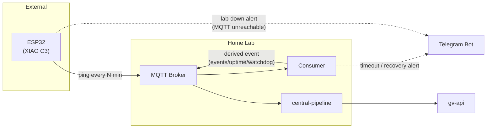

# Feature: Uptime API feed

Two uptime series are tracked: **lab** (detected by the ESP32 — MQTT unreachable) and **watchdog** (detected by the consumer — ESP32 pings silent).

## System topology

mutual-watchdog is responsible for monitoring and alerting only. Persistence is handled by central-pipeline, which consumes all MQTT topics and feeds gv-api.



## Event payload

Both series share the same shape, distinguished by `source`:

```json
{
  "source": "watchdog",
  "down_at": "2026-05-31T03:14:00Z",
  "up_at": "2026-05-31T04:01:00Z",
  "duration_secs": 2820
}
```

`source` values: `"watchdog"` (ESP32 silent) · `"lab"` (lab offline, consumer restarted)

For **lab events**: `down_at` is the last known ping time before the outage, `up_at` is the consumer boot time after recovery.

## Checklist

- [x] Define MQTT topic schema for derived events (`events/uptime/watchdog`, `events/uptime/lab`)
- [x] Persist uptime state to disk via the `Uptime` struct (`device` / `status` / `timestamp`); reconstruct outage window on recovery
- [ ] Publish derived event to MQTT on recovery (central-pipeline handles persistence from there)
- [ ] On lab restart: publish lab outage event to MQTT using last known ping time as `down_at`
