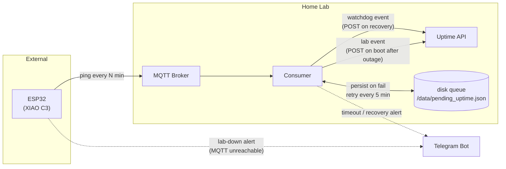

# Feature: Uptime API feed

Two uptime series are tracked: **lab** (detected by the ESP32 — MQTT unreachable) and **watchdog** (detected by the consumer — ESP32 pings silent).

## System topology

The Uptime API runs inside the home lab alongside the consumer. When the lab restarts both come up together but not in lockstep — events are queued to disk to bridge the startup race, and flushed once the API is ready.



## Event payload

Both series share the same shape, distinguished by `source`:

```json
{
  "source": "watchdog",
  "down_at": "2026-05-31T03:14:00Z",
  "up_at": "2026-05-31T04:01:00Z",
  "duration_secs": 2820
}
```

`source` values: `"watchdog"` (ESP32 silent) · `"lab"` (lab offline, consumer restarted)

For **lab events**: `down_at` is the last known ping time before the outage, `up_at` is the consumer boot time after recovery.

## Checklist

- [ ] Create `/data` folder, Docker volume, and env vars (`UPTIME_API_URL`, `UPTIME_API_TOKEN`, `UPTIME_QUEUE_FILE`)
- [ ] Persist consumer downtime — write `down_since` + `last_ping_at` to disk; reconstruct lab outage window on next boot
- [ ] Persist watchdog downtime — write `down_since` when alert fires; complete the event on recovery ping
- [ ] Send events to API — POST on recovery, queue to disk on failure, retry every 5 min
