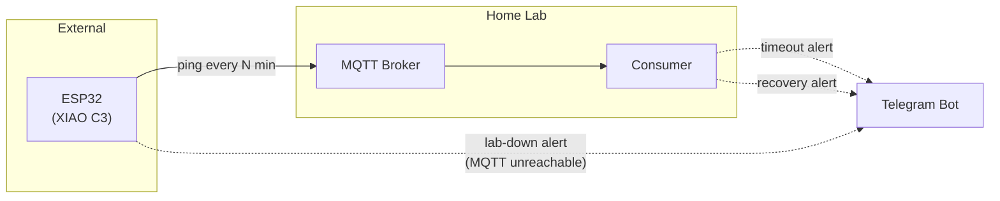
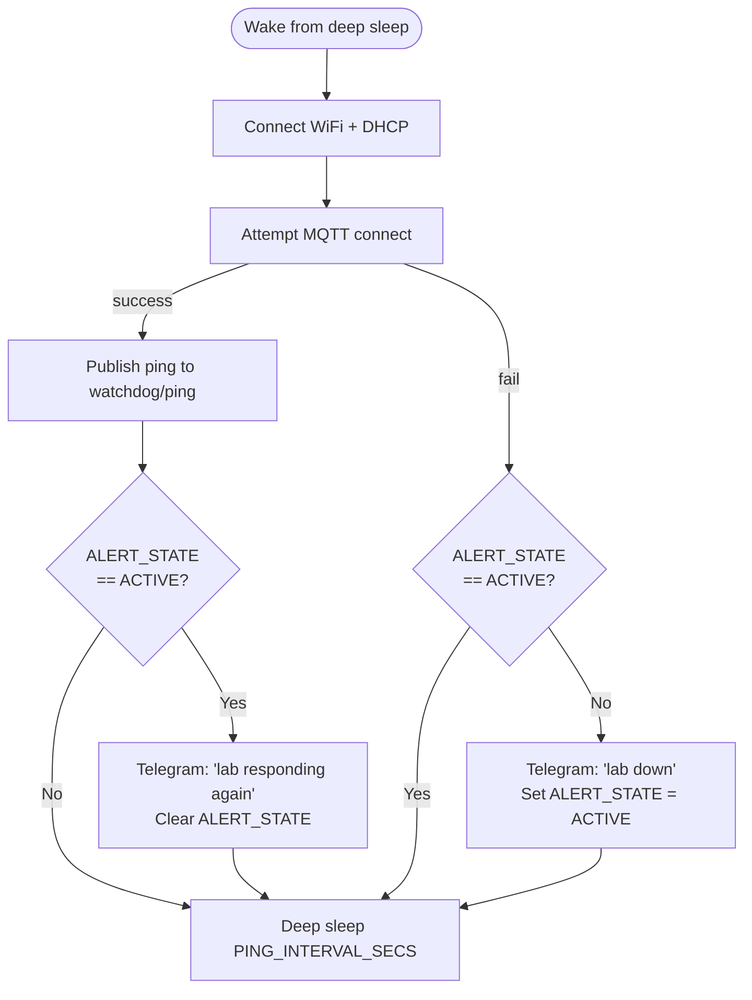
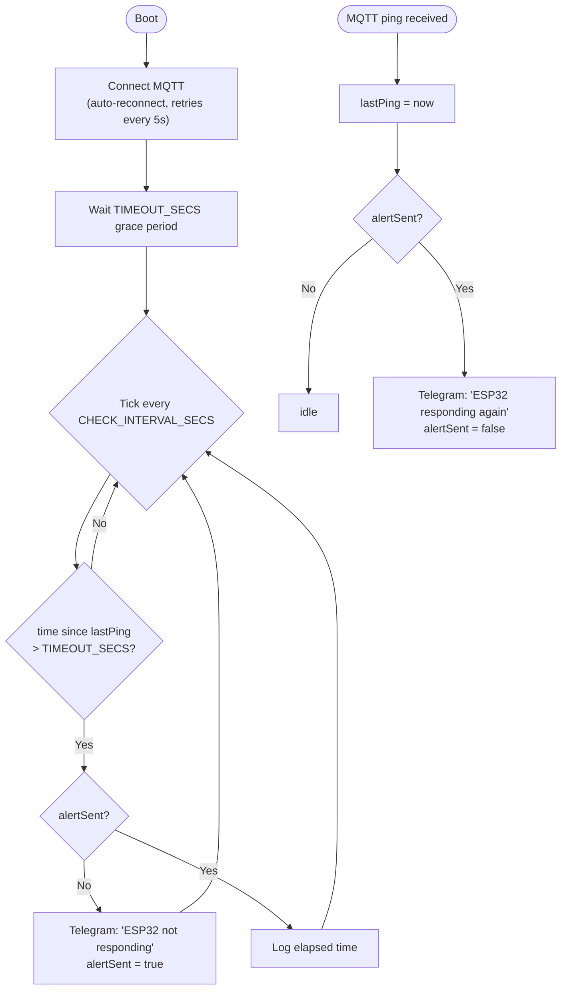

# State Flow

## System topology

Both MQTT broker and consumer run inside the home lab. The ESP32 is the only external node

## ESP32 - per wake cycle

Runs once per `PING_INTERVAL_SECS`. The only state that persists across cycles is `ALERT_STATE` in RTC memory.

## Consumer -- continuous process

Runs as a Docker container. In-memory state.

